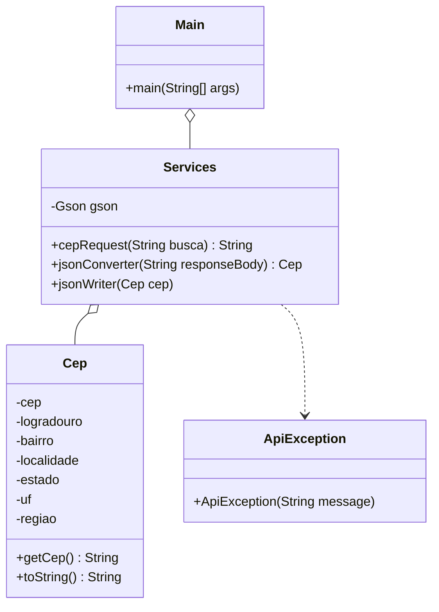

# BuscaCEP

O projeto BuscaCEP é uma aplicação Java desenvolvida para consultar informações de CEP (Código de Endereçamento Postal) utilizando a API do [ViaCEP](https://viacep.com.br/). A principal funcionalidade é a obtenção de dados detalhados de um endereço a partir do CEP informado, realizando requisições HTTP, retornando as informações de forma estruturada e salvando os resultados em arquivos JSON.

## Funcionalidades

- Consultar informações de um CEP (endereço, bairro, cidade, estado, etc.).
- Validar se o CEP inserido tem um formato correto (apenas números e 8 dígitos).
- Exibir as informações do CEP na tela.
- Salvar os resultados da consulta em um arquivo JSON.

## Tecnologias Utilizadas

- **Java**: Linguagem de programação.
- **HttpClient**: Biblioteca para fazer requisições HTTP.
- **Gson**: Biblioteca para converter JSON para objetos Java e vice-versa.
- **ViaCEP API**: API utilizada para obter informações de um CEP.

## Diagrama de Classes



## Requisitos

- **Java 11** ou superior.
- Biblioteca `Gson` (o JAR está incluído na pasta `Dependencies`).

## Como Executar o Projeto

1. **Clone o repositório:**
   ```bash
   git clone https://github.com/pabloviniciustbbt/BuscaCEP.git
   ```
2. **Entre no diretório do projeto via prompt de comando e execute a compilação:**
   ```bash
   javac -cp ".;Dependencies/gson-2.11.0.jar" -d bin @sources.txt
   ````
3. **Execute o Projeto:**
   ```bash
   java -cp "bin;Dependencies/gson-2.11.0.jar" com.pabloleal.buscacep.Main
   ```
   

## Exemplo de Saída:

```bash
=================================
            BUSCA CEP    
=================================

Escolha uma das opções abaixo:

1. Consultar CEP
0. Sair

Digite aqui: 1

Digite um CEP para consulta: 01001000

CEP: 01001-000
Logradouro: Praça da Sé
Bairro: Sé
Cidade: São Paulo
Estado: SP
UF: SP
Região: Sudeste

==============================================
          Arquivo gerado com Sucesso!
==============================================

Escolha uma das opções abaixo:

1. Consultar CEP
0. Sair

Digite aqui: 0

Saindo...
```

## Contribuições:

Sinta-se à vontade para contribuir com o projeto! Se você tem sugestões de melhorias, correções de bugs ou novas funcionalidades, abra um Pull Request e ajude a tornar o BuscaCEP ainda melhor.

Divirta-se explorando o BuscaCEP e descobrindo novas informações sobre endereços!📍
